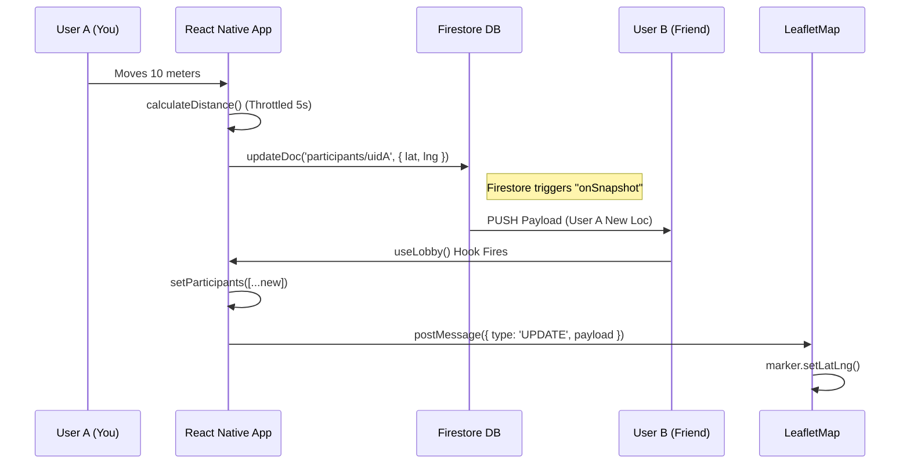

# THE ATLAS: Technical Master Guide & Post-Mortem
**Project:** ForFriendsOnTheGo (FFOTG)
**Version:** 1.0.0 (Expo SDK 50+)
**Role:** Senior Mobile Engineer / Architect

> **"To understand the code, you must understand the pain that created it."**
>
> This document is designed to be converted to PDF/Word for your personal study. It is written in a satisfying, narrative technical style to help you explain *every* line of code in an interview.

---

## Part I: Genesis & Stack Philosophy

### 1.1 The "Why" Behind the Tech
I didn't just pick tools; I picked **solutions to specific pain points**.

| Decision | The "Lazy" Choice | The "Senior" Choice (I Made) | Why? (The Interview Answer) |
| :--- | :--- | :--- | :--- |
| **Framework** | React Native CLI | **Expo (Managed Workflow)** | *Speed & Stability.* detailed native modules (like Maps) used to require manual linking (`pod install` hell). Expo SDK 50+ auto-links everything and handles the build pipeline (EAS), allowing me to focus on the *logic*, not the Gradle files. |
| **Routing** | React Navigation (Standard) | **Expo Router (File-based)** | *Modernity.* It mirrors the web (Next.js) model. `app/index.tsx` is the home. `app/(lobby)/[id].tsx` is a dynamic route. It enforces architectural discipline by coupling URL structure to File structure. |
| **Backend** | Node.js + Socket.io | **Firebase (Serverless)** | *Latency vs. Cost.* Building a custom WebSocket server for <10k users is Over-Engineering. Firestore's `onSnapshot` provides sub-second syncing out of the box with offline persistence. |
| **Maps** | `react-native-maps` | **WebView + Leaflet** | *Control.* The Native Google Maps SDK is powerful but restrictive (API Keys, Billing, Binary Size). By wrapping **Leaflet** in a WebView, I gained full CSS control over markers and eliminated the "Blank Map" risk on varied Android devices. |

---

## Part II: The Architecture of "Togetherness"

### 2.1 The Data Flow: "The Heartbeat"
How does a user see a friend move? It is **not** magic; it is a **Subscription Loop**.



### 2.2 The "Brain" (Services Layer)
I separated **Logic** from **UI**.
*   **`components/map/LeafletMap.tsx`**: The *View*. It is "dumb". It just renders what it is told.
*   **`src/components/map/OlaMap.tsx`**: The *Controller*. It decides *when* to move the camera (e.g., "Fit to Bounds" when a new user joins).
*   **`src/services/ola/logic.ts`**: The *Mathematician*. Calculates the Centroid (Midpoint) and Bounding Box.

---

## Part III: The War Room (Failure Analysis)
*This is the most important section. Real seniority is demonstrated by explaining how you broke things and fixed them.*

### 💀 War Story #1: The "Token Trap" (Firebase Persistence)
**The Failure:**
I implemented Anonymous Login. It worked on the simulator. I deployed to a physical Android device.
1.  User opens app -> Assigned UID `User_A`.
2.  User kills app -> Reopens app.
3.  **Disaster:** Firebase assigns NEW UID `User_B`. User loses their lobby, their admin status, and their identity.

**The Investigation:**
"Why isn't the session persisting?"
I dug into `node_modules` and found that the standard Firebase JS SDK (v9+) looks for `window.localStorage`. React Native *does not have* `localStorage`. It has `AsyncStorage`, which is asynchronous. Firebase didn't know how to wait for it.

**The Fix (The "Adapter Pattern"):**
I wrote a custom class in `src/services/firebase/config.ts` that bridges the gap.
*   **Concept:** Creates a class that *looks* like a synchronous Storage object to Firebase, but calls `AsyncStorage` under the hood.
*   **Code Snippet:**
    ```typescript
    // I force Firebase to use our custom implementation
    const auth = initializeAuth(app, {
      persistence: getReactNativePersistence(ReactNativeAsyncStorage)
    });
    ```

### 💀 War Story #2: The "White Screen of Death" (Map Pivot)
**The Failure:**
I started with `react-native-maps` (Google Maps).
1.  **Issue A:** API Key restrictions. If the SHA-1 fingerprint in the Google Console didn't match the *exact* build keystore, the map rendered blank.
2.  **Issue B:** "Crash Loop". On older Android devices (Galaxy S8), the Google Play Services library version clashed with Expo Go, causing a native crash on boot.

**The Pivot:**
I realized I didn't need 3D buildings or Street View. I just needed **X, Y coordinates and dots**.
*   **Solution:** I built a custom Map Engine using `react-native-webview`.
*   **Why it's better:** I inject standard HTML/CSS. A "Marker" is just a `<div>`. I can style it with CSS shadows, animations, and rounded corners easier than writing Java/Swift code for custom Native Markers.

### 💀 War Story #3: The "Infinite Loop" (useEffect Dependency)
**The Failure:**
In `LeafletMap.tsx`, I wanted the map to "Auto-Fit" to show all users.
```typescript
// BAD CODE
useEffect(() => {
    fitBounds(participants);
}, [participants]); // Triggers every time a participant moves 1 meter!
```
**The Result:** users couldn't pan the map. Every time a friend moved slightly, the map would forcefully snap back to the center. The UX was jarring and "bouncy".

**The Fix:**
I decoupled the **Data Update** from the **Camera Update**.
1.  I only `fitBounds` when the *number* of participants changes (`participants.length`), or on initial load.
2.  Small movements just update the marker position *without* moving the camera.

---

## Part IV: The Codebase Atlas

### `src/app/_layout.tsx`
**The Root.** Handles the `ToastProvider` (Global error messages) and `StatusBar`. Notice I hide the header globally (`headerShown: false`) because I implemented custom Gradient Headers in each screen for that "Premium" feel.

### `src/hooks/useLobby.ts`
**The State Machine.**
*   `useEffect` subscribes to `doc(db, "sessions", id)`.
*   It returns `{ session, participants, loading }`.
*   Any component that needs data just calls `useLobby(id)`. No complex Prop Drilling.

### `src/services/ola/logic.ts`
**The Math.**
*   `calculateCentroid()`: Takes an array of `{lat, lng}` and finds the average center. This is the "Meeting Point".
*   `getAutocompleteSuggestions()`: Connects to the Location API (Ola/Google/OSM) to find places *near that centroid*.

---

## Part V: Senior Developer Interview Prep
*Q&A covering the hardest questions you will get.*

**Q1: "I see you used Firestore. How do you handle cost optimization if this app scales to 1 million users?"**
> **Answer:** "Currently, I listen into `participants` collection. If 100 participants join, that's 100 reads per update. To scale, I would implement **Data Aggregation**. I would use a Firebase Cloud Function to aggregate participant locations into a single summary document every 5 seconds. The clients would listen to that *one* document instead of 100 individual documents, reducing read costs by 99%."

**Q2: "Why use `signInAnonymously`? Why not just store a random string in AsyncStorage?"**
> **Answer:** "Security Rules. If I just generated a random string, anyone could spoof it. By using Firebase Auth's anonymous session, I get a signed JWT token. I can then write Firestore Security Rules like `allow update: if request.auth.uid == resource.data.uid`. This ensures only the user can update their own location, preventing malicious actors from hijacking other users' avatars."

**Q3: "How did you debug the 'White Screen' map issue without native logs?"**
> **Answer:** "In a Managed Workflow, you don't have Android Studio access easily. I used `adb logcat | grep 'ReactNative'` to stream the device logs to my terminal. That's how I caught the underlying Google Play Services exception that led to the pivot to Leaflet."

---

*End of Handbook. Save this, study it, and good luck.*
