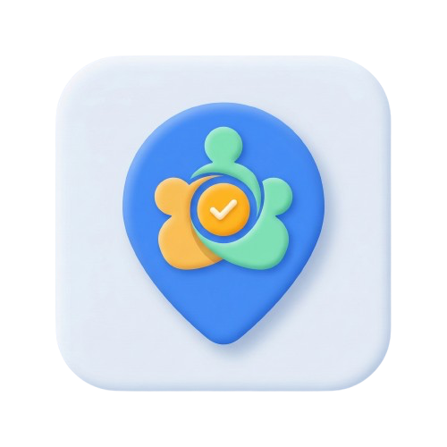

<div align="center">
  
  
  # For Friends On The Go 🚗💨
  
  **The ultimate real-time location sharing and social planning app for tight-knit squads.**
  
  [](https://reactnative.dev/)
  [](https://expo.dev/)
  [](https://firebase.google.com/)
  [](https://tamagui.dev/)
</div>

---

## 💡 The Concept

Ever struggled to coordinate a meetup with friends? "Where are you?" "I'm 5 minutes away!" (Fact: *They were not 5 minutes away.*)

**For Friends On The Go** solves the eternal chaos of group meetups. It’s a dynamic, real-time social utility that lets you create temporary "Lobbies" for events, track your squad's live locations on a map, sync up on destinations, and vote on the fly. 

**This isn't just a map app; it's a real-time social multiplayer experience.**

---

## ✨ Features (Showcasing Creativity)

- 🎮 **Live Lobbies**: Just like a multiplayer video game. Create a lobby, invite your friends, and see everyone drop onto the live map. Leave the lobby, and your location goes private again instantly.
- 🗺️ **Real-Time Multiplayer Map**: Powered by responsive location subscription hooks and map clustering, watching your friends converge on a single point feels magical.
- 🗳️ **Democratic Destination Voting**: Can't decide where to eat? Anyone in the lobby can suggest a place using the **Add Place Sheet**, and the squad votes. Highest votes win.
- 👤 **Dynamic Avatars & Profiles**: Express yourself with randomized avatars (powered by a robust state management system) and keep your inner circle close with a native friend system.
- 🛡️ **Exit Guards**: Accidentally swiped away? Smart lobby exit guards prevent dropping out of active hangouts unintentionally. 

---

## 🛠️ Technical Capabilities (Under the Hood)

This app is engineered to handle highly concurrent read/writes while maintaining a silky-smooth **60 FPS UI**.

### Architecture & Stack
- **Framework**: Built on **React Native (Expo Router)** leveraging the new architecture for highly performant mobile rendering across iOS and Android.
- **Styling Engine**: Powered by **Tamagui**, utilizing an optimizing compiler that extracts styles to atomic CSS, resulting in near-zero runtime overhead for animations and layouts.
- **Database & Sync**: Heavily relies on **Firebase Firestore** with complex, battle-tested Security Rules. Includes transactional implementations for atomic operations (e.g., two-way friend deletions to prevent data desynchronization).
- **Mapping & Routing**: Deep integration with **Ola Maps API** and **Google Maps** (configured dynamically for remote builds based on EAS env secrets), enabling custom map styling and point-to-point routing logic.
- **State & Animation**: Uses `react-native-reanimated` and `react-native-gesture-handler` for fluid, physics-based micro-interactions (like bottom sheets and avatar carousels).

### Hard Problems Solved
1. **Real-time Map State Desync**: Overcame race conditions with Firebase listeners and React state by implementing smart debounce and highly localized state updates for avatar coordinates.
2. **Keyboard Avoidance & Auth Flows**: Implemented bulletproof form mechanics during account creation, preventing deadlocks and ghost-state UI glitches.
3. **CI/CD with EAS**: Configured complex environment parity mapping (Metro static inlining) ensuring local `.env.local` functionality maps perfectly to Expo Application Services (EAS) cloud build secrets.

---

## 🚀 Getting Started

### Prerequisites
- Node.js (v18+)
- Yarn or npm
- Expo CLI
- A Firebase project with Firestore and Authentication enabled
- Ola Maps / Google Maps API Keys

### Installation

1. **Clone the repo**
   ```bash
   git clone https://github.com/Danish2op/For-Friends-On-The-Go.git
   cd For-Friends-On-The-Go
   ```

2. **Install dependencies**
   ```bash
   yarn install
   ```

3. **Set up Environment Variables**
   Create a `.env.local` file in the root directory:
   ```env
   EXPO_PUBLIC_OLA_MAPS_API_KEY=your_ola_maps_key
   EXPO_PUBLIC_GOOGLE_MAPS_API_KEY=your_google_maps_key
   ```

4. **Run the App**
   ```bash
   yarn start
   # Press 'i' for iOS emulator, 'a' for Android emulator
   ```

---

## 📦 Build & Deploy

This project uses EAS (Expo Application Services) for automated cloud deployments.

```bash
# To trigger a cloud build for Android
eas build --platform android --profile preview

# To update the live app instantly over-the-air (OTA)
eas update --branch preview --message "Updating map UI"
```

---

<div align="center">
  <i>Built thoughtfully by Danish Sharma</i>
</div>
